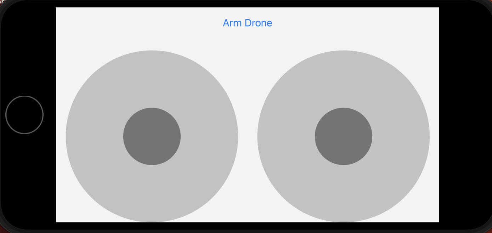
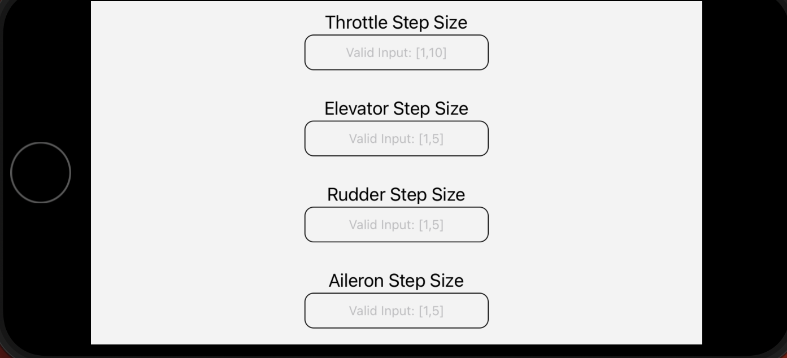

<h1>Complete control of Drone using our Mobile App for hand-held IOS devices</h1>

<h3>Step 1: Initial Setup</h3>

1. Open a new terminal window and run the below command to clone this repository.

    ```
    git clone https://github.com/SLUSE-Spring2022/sprint1-team6_sprint1.git
    ```

2. Create a python virtual environment inside the cloned repository on local.

    ```
    python3 -m venv venv
    ```

3. Activate the virtual environment.

    ```
    source venv/bin/activate
    ```

4. Install flask web server framework.
    
    ```
    pip install flask
    ```

5. Install dronekit-sitl library.
    
    ```
    pip install dronekit-sitl
    ```

6. Go into site-pacakages directory in the virtual environment libraries directory.
    
    ```
    cd venv/lib/python3.11/site-packages
    ```

7. Delete the ***dronekit*** directory from sitepackages.

8. Clone the dronekit-python repository in site-packages.

    ```
    git clone https://github.com/dronekit/dronekit-python.git
    ```

9. Follow the steps in this <a href="https://dronekit-python.readthedocs.io/en/latest/contributing/developer_setup_linux.html">link</a> to build and install dronekit library.

10. Clone and install ardupilot for using the simulator functionalities.

11. Follow this <a href="https://reactnative.dev/docs/environment-setup?guide=native">link</a> to download and install react-native development framework to run IOS device emulator.

12. Deactivate the virtual environment and close the terminal.

    ```
    deactivate
    ```

<h3>Installation Steps for Cocoapods</h3>

1. open a new terminal window.

2. Run the below command to install cocoapods.

    ```
    sudo gem install cocoapods
    ```

3. If you are successful in installing cocoapods from above step ignore all the below steps.

4. If you are not successful in downloading cocoapods follow the below steps. Switch to root user:

    ```
    sudo su -
    ```

5. Change write permissions for /Library/Ruby/Gems/2.6.0 directory

    ```
    chmod -R u+w /Library/Ruby/Gems/2.6.0
    ```

6. Update activesupport version.

    ```
    gem install activesupport -v 6.1.7.3
    ```

7. Make sure you have installed xcode command line tools. If you dont have the xcode CLI tools, install them.

    ```
    xcode-select --install
    ```

8. Now install cocoapods using the command from step-2 under ***Installation of cocoapods***.


<h3>Step 2: Run ArduPlane simulator and Flask web server</h3>

1. Open a new terminal window and activate the python virtual environment.

    ```
    source venv/bin/activate
    ```

    ***Note:*** Make sure you go into the sprint1-team6_sprint1 directory before activating the virtual environment.

2. Go into ArduPlane directory inside ardupilot.

    ```
    cd ardupilot/ArduPlane
    ```

3. Open the simulator.

    ```
    sim_vehicle.py --map --console
    ```

    ***Note:*** Make sure you add the path to sim_vehicle.py to your .bashrc fie and source the .bashrc file before running the above command.

4. From this terminal copy the sitl out url and paste it in the connection_string variable in Drone_Program.py file and save it.

5. Open a new terminal window and activate the python virtual environment.

    ```
    source venv/bin/activate
    ```

    ***Note:*** Make sure you go into the sprint1-team6_sprint1 directory before activating the virtual environment.

6. Export your flask app.

    ```
    export FLASK_APP=FlaskWebServer.py
    ```

7. Run your flask server.

    ```
    flask run
    ```

8. Copy the url displayed in this terminal and replace the url it in the App.tsx file inside AwesomeProject directory. After changing the url the code inside processArm() function should look like this.

    ```
    fetch('<your-server-url>/arm', {
      method: 'POST',
      headers: {
        Accept: 'application/json',
        'Content-Type': 'application/json',
      },
      body: JSON.stringify({
        message: 'ArmDrone'
      }),
    })
      .then(response => response.json())
      .catch(error => {
        console.error(error);
      });
    ```


<h3> Step 3: Run the emulator and test the arm function</h3>

1. Open a new terminal window and go inside sprint1-team6_sprint1 cloned local repository.

2. Go inside AwesomeProject directory.

    ```
    cd AwesomeProject
    ```

3. Run your IOS emulator and open the application in the emulator.

    ```
    npx react-native run-ios
    ```

    ***Note:*** If a new terminal window appears prompting you to select the device type just click 'i' and then click 'return/enter'.

4. Once the app gets opened on your emulator click the ***Arm Drone*** button in the app and observe the drone getting armed in the console opened as a part of opening the simulator.

5. After successfully testing the application go to each terminal window and use  ***'^+C'***  keyboard shortcut to end the running process.

6. Deactivate the virtual environment.

    ```
    deactivate
    ```

7. Close the opened terminal windows.


<h3> Instructions to fly the drone </h3>

***NOTE:*** Prior to using joysticks please click on the ArmDrone button as armDrone function is the one which actually connects to the drone.

1. For flying the the drone skip the steps ***5, 6, 7*** from ***Run the emulator and test the arm function***.

***NOTE:*** For ease of access of the joysticks rotate your mobile device into landscape mode before flying the drone.

2. Click the ***ArmDrone*** button on the app to arm the drone prior to flying the drone. Make sure the drone is armed before increasing the throttle of the drone to prep it for takeoff.

3. Slide your left joystick on the app to up position to increase the throttle of the drone.

4. Wait till the throttle value reaches to a value between ***60*** and ***70***. After it reaches that particular throttle value slide your right joystick on the app to down position for takeoff.

5. To decrease the throttle value slide your left joystick on the app to down position.

6. To increase the pitch/elevator value slide your right joystick on the app to down position.

7. Slide your right joystick on the app to up position to decrease the pitch.

8. To change the rudder position and control the yaw movement of an ArduPlane use left joystick left and right movements on the mobile app.

9. To change the aileron position and control the roll movement of an ArduPlane use right joystick left and right movements on the mobile app.

***Note***: While using rudder and aileron in combination make sure you are changing both to same side to turn the plane. If you are changing the rudder to turn left and aileron to roll right the plane goes straight without changing its direction and gets shaky.

<h3> Step Sizes Documentation </h3>

1. Throttle:

    a. Input Type: Float

    b. Accepted Range: [1,10] both 1 and 10 inclusive.

1. Rudder:

    a. Input Type: Float

    b. Accepted Range: [1,5] both 1 and 5 inclusive.

1. Aileron:

    a. Input Type: Float

    b. Accepted Range: [1,10] both 1 and 5 inclusive.

1. Elevator:

    a. Input Type: Float

    b. Accepted Range: [1,10] both 1 and 5 inclusive.

<h3> Web Server API Documentation </h3>

1. ArmDrone request:

    a. Request url: http://127.0.0.1:5000/arm

    b. Method: POST

    c. Accepted parameter type: String

    d. Accepted parameter value: 'ArmDrone'

    e. Description: ArmDrone request arms the drone when the button 'ArmDrone' is clicked on the mobile app. The drone should be armed prior to flying it.

2. Throttle request:

    a. Request url: http://127.0.0.1:5000/throttle

    b. Method: POST

    c. Accepted parameter type: String

    d. Accepted parameter values: 'IncThrottle', 'DecThrottle'

    e. Description: Throttle request is responsible for changing the throttle of the drone when the left joystick is moved up or down in the mobile app. When the joystick is dragged to up position the message 'IncThrottle' is sent to flask web server which increases the throttle of the plane while moving the left joystick to down position 'DecThrottle' message is sent to the flask web server which decreases the throttle of the plane.

3. Elevator request:

    a. Request url: http://127.0.0.1:5000/elevator

    b. Method: POST

    c. Accepted parameter type: Float

    d. Accepted parameter values range: [-1,1] (both -1 and 1 are included)

    e. Description: Elevator request is responsible for changing the pitch of the drone when the right joystick is moved up or down in the mobile app. When the joystick is dragged to up position the the y coordinate of the joystick position whose value is between -1 and 0 is sent to flask web server which decreases the pitch of the plane while moving the joystick to down position the y coordinate of the joystick position whose value is between 0 and 1 is sent to flask web server which increases the pitch of the plane.

4. Rudder request:

    a. Request url: http://127.0.0.1:5000/rudder

    b. Method: POST

    c. Accepted parameter type: Float

    d. Accepted parameter values range: [-1,1] (both -1 and 1 are included)

    e. Description: Rudder request is responsible for changing the yaw movement of the drone when the left joystick is moved in left or right directions in the mobile app. When the joystick is dragged to left position the the x coordinate of the joystick position whose value is between -1 and 0 is sent to flask web server which turns the plane to left direction while moving the joystick to right position the x coordinate of the joystick position whose value is between 0 and 1 is sent to flask web server which turns the plane to right direction. The axis considered for this movement is a perpendicular axis passing through the center of the plane.

5. Aileron request:

    a. Request url: http://127.0.0.1:5000/aileron

    b. Method: POST

    c. Accepted parameter type: Float

    d. Accepted parameter values range: [-1,1] (both -1 and 1 are included)

    e. Description: Aileron request is responsible for changing the roll movement of the drone when the right joystick is moved in left or right directions in the mobile app. When the joystick is dragged to left position the the x coordinate of the joystick position whose value is between -1 and 0 is sent to flask web server which tilts/rolls the plane in left direction while moving the joystick to right position the x coordinate of the joystick position whose value is between 0 and 1 is sent to flask web server which tilts/rolls the plane in right direction. The axis considered for this movement passes form the tail to the nose tip of the plane.

<h3> Axes Representation of the plane </h3>


<h3> User Interface Analysis Against 8 Golden Rules </h3>





<h5>1. Strive for consistency</h5>

We have followed color, font and capitilization consistency while designing the interface. All the labels of text boxes have the same font and layout capitilization. All the similar components have same color and sizes reducing the confusion among users such as borders of text boxes, size of text boxes, font color of labels and placeholder texts, etc.

<h5>2. Seek Universal Usability</h5>

We have a single-page mobile application that is simple enough for people of all ages and expertise levels to understand. A button to arm the drone, two joysticks to operate the drone, and four textbooks are all included in the entire UI. 

If screen size and orientation are taken into account, we should have put in more effort since when the phone is in portrait position, the joysticks overlap and the UI components do not arrange themselves correctly. However, the user interface (UI) looks fantastic when the phone is in landscape position since there is a clear gap formed between the joysticks, making it easier for the user to utilize them.

<h5>3. Offer Informative Feedback</h5>

Our mobile application doesn't give users any feedback in response to their activities. However, it uses placeholder text in the UI's text fields to show the acceptable input ranges for the step sizes.

However, we can add more features so that when the armDrone button is clicked, our app notifies the user whether the drone was successfully armed or not. We can also add alerts for when the user enters incorrect step sizes for the various drone controls in the provided text boxes.

<h5>4. Closure</h5>

Because it doesn't offer any feedback based on the users' activities, our mobile application doesn't give them any closure. For instance, if the drone cannot be successfully armed, the user may still operate the joysticks, but this does not indicate that the drone is in flight because it is unarmed. The user becomes confused as a result, making it difficult for them to determine if they are controlling the drone correctly. 

By locking the joysticks until the drone is successfully armed in a future version and maybe printing the values for throttle, pitch, yaw, and roll, this uncertainty can be removed, allowing the user to handle the drone smoothly.

<h5>5. Prevent Errors</h5>

Our mobile application may not offer users feedback, but it does stop them from making mistakes. For instance, if the user enters an invalid input for step sizes, such as one that is out of range or the wrong type, the app will automatically set the step size to 1 by performing validation each time the text in the provided textbooks is changed, unless the user enters a valid input. 

Other enhancement for this rule would be to disable the joysticks until the plane is armed successfully which can be considered for the future.

<h5>6. Allow easy reversal of actions</h5>

Our mobile applications don't offer any undo mechanisms for user activities, such as reversing step size inputs to earlier inputs when the user has entered an erroneous value and wants to return to earlier inputs. However, a button that allows users to simply reverse their activities and return to their previous state would be an excellent enhancement to our mobile application.

<h5>7. Keep users in control</h5>

Our mobile app puts the customers in charge since it is an easy-to-use single-page application. The mobile device has two joysticks for controlling the drone, a button to arm it, and four text fields for different drone control step sizes. The interface makes it simple to discover each of these controls. The text boxes are in the first section, and the joysticks and arm buttons are farther down in the interface. 

Although there is no functionality in our mobile app to automatically fill in the data, we do prevent mistakes by changing the variable corresponding to the textboxes to its default value whenever no input is provided or invalid information is presented.

<h5>8. Reduce Short term memory load</h5>

When using our application, a user only has to know two things: to click the arm drone button before using the joysticks to control the drone, and what each movement of the various joysticks means for controlling the drone. In addition to this, labels and placeholder texts for step size inputs are available to users as additional forms of assistance. As a result, using our application is simple and doesn't need the user to keep many details in mind.
